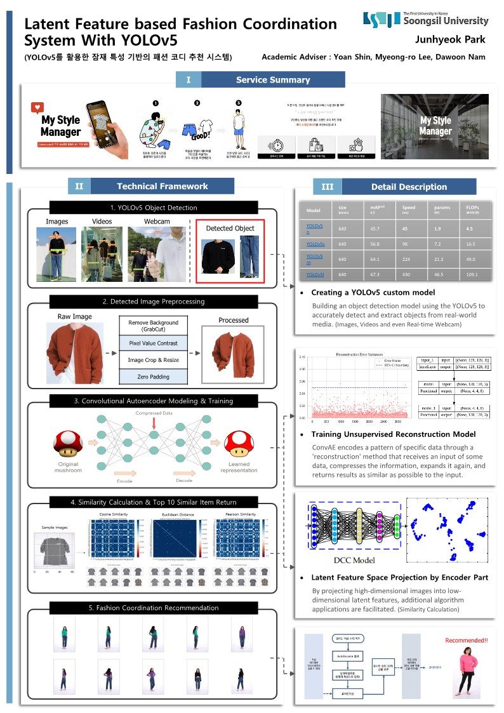
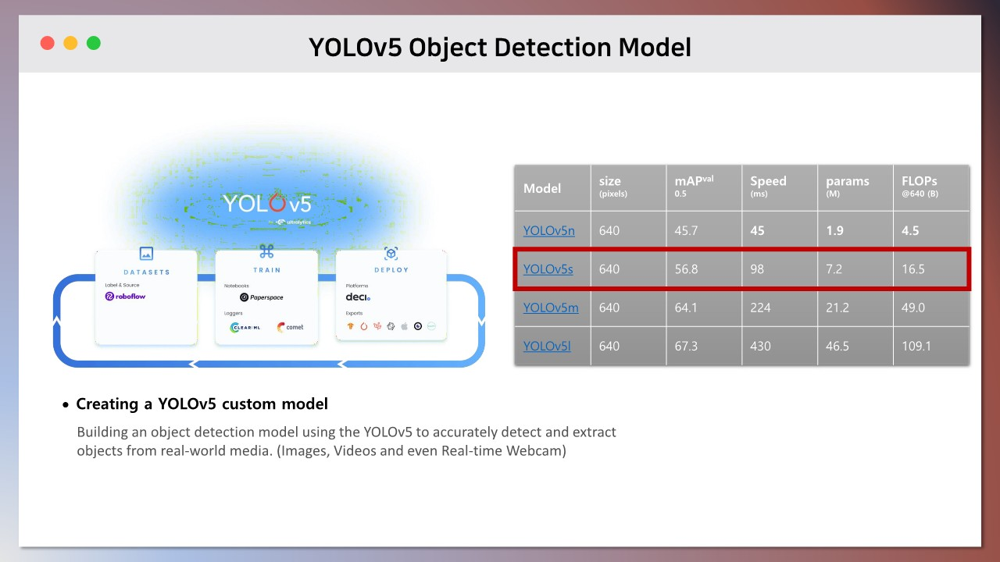
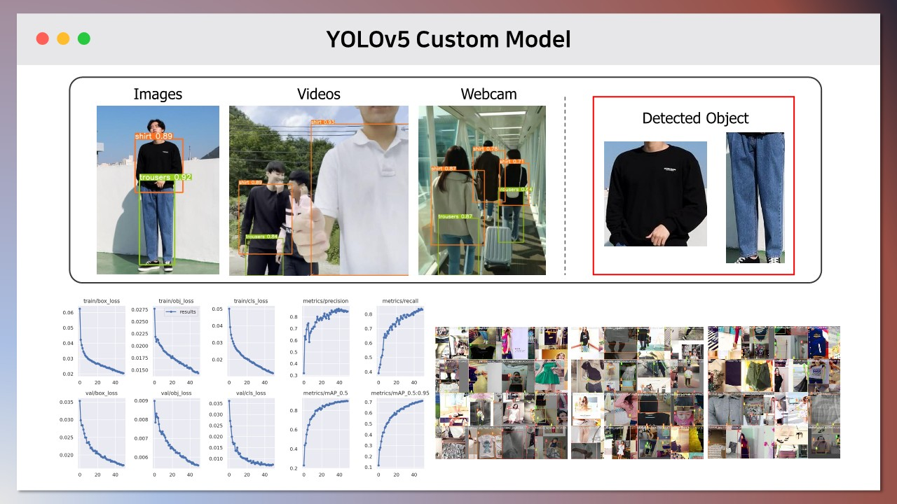
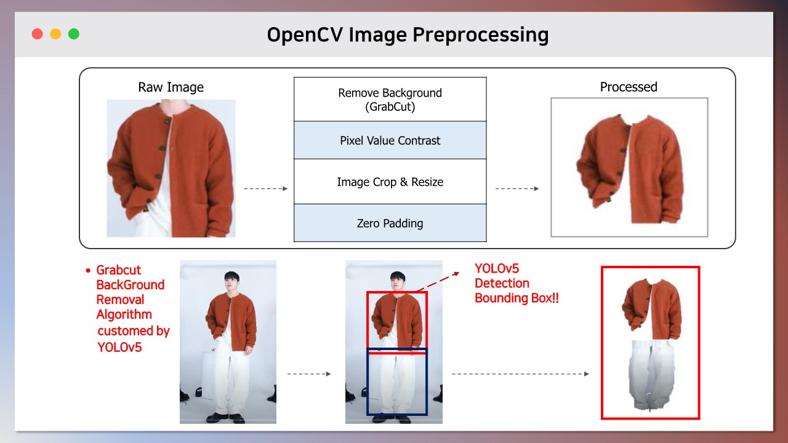
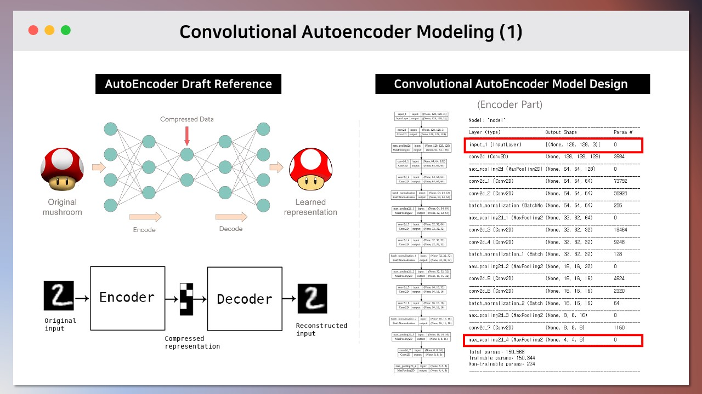
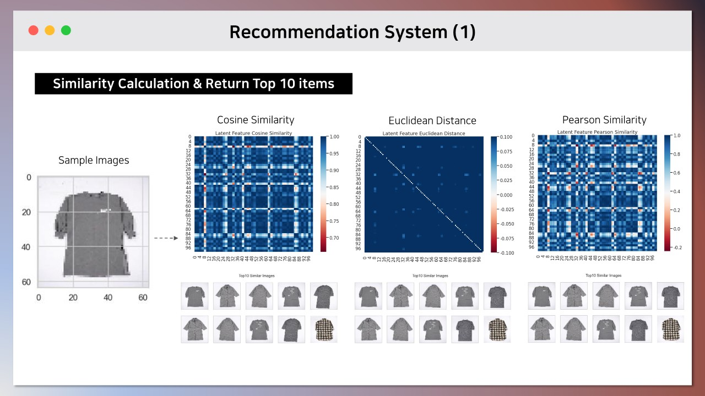
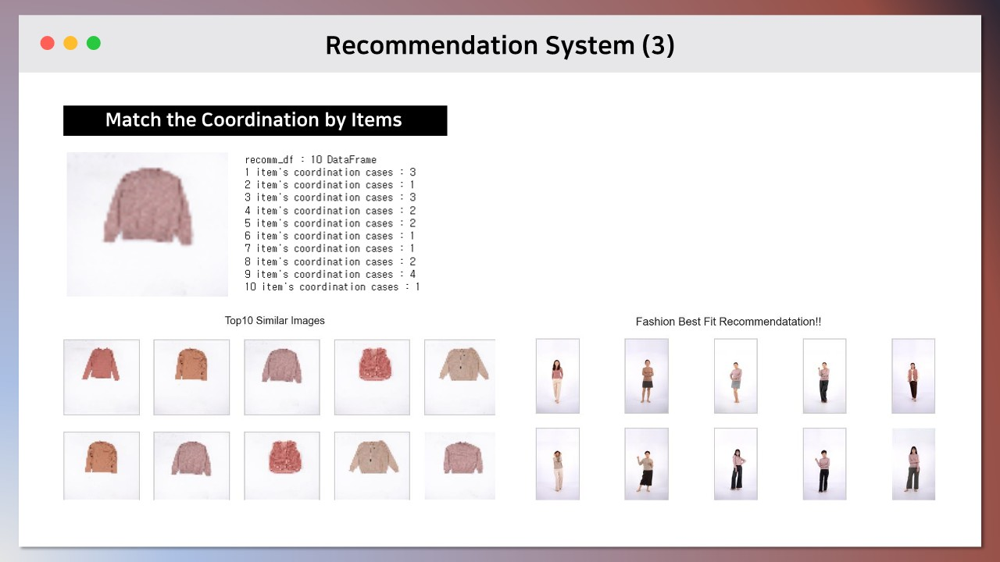
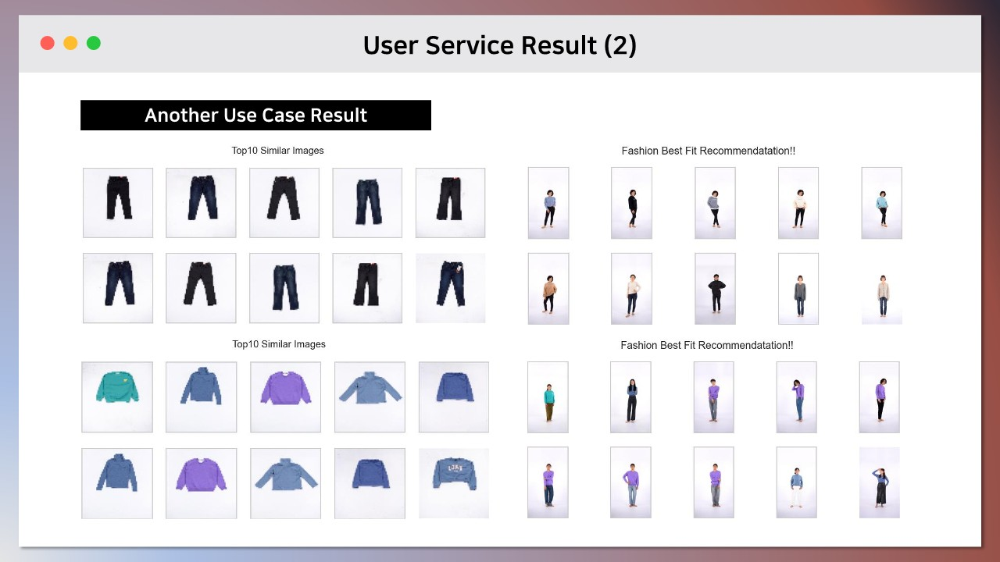

# 🎓 Graduation_Project
Awarded Dean of the Electronic Information Engineering Department's Graduation Project in 2022
   
## 👚 Latent Feature based Fashion Recommendation System with YOLOv5
  We constructed an Image Content-based Recommendation System using the Generative Model's Latent Feature. Existing static and inflexible workflows were added with Unsupervised Learning Mechanism and YOLOv5 custom models to build a more flexible and versatile system.   
     
     

### Link
Team Notion - [Fashion Recommendation System Team Notion](https://www.notion.so/likelion-aischool/Image-Based-Fashion-Styling-Recommendation-System-497d65f71315438bbb1eef32ab00bf69)   
Streamlit - [Fashion Recommendation System Streamlit Dashboard](https://lion-hill-final-project-main-gyuho-h3kna3.streamlitapp.com/)   
ConvAE Raw Data Source - [ConvAE Raw Data Source](https://aihub.or.kr/aihubdata/data/view.do?currMenu=115&topMenu=100&aihubDataSe=realm&dataSetSn=78)   
YOLOv5 Raw Data Source - [YOLOv5 Raw Data Source](https://universe.roboflow.com/)   

### Contents
>Convolutional AutoEncoder와 YOLOv5를 활용한 Image 잠재 표현형과 각종 유사도 지표 기반의 Daily 코디 추천 서비스

>💚 *이른 아침 눈을 뜨고 나갈 준비를 하면서 어떤 옷을 입지?**🤔***

>*‘고민하고 있는 당신!’* 

>*당신을 위한 쉽고 간편한 코디 추천 모델을 추천해드립니다!*

>***오늘 입고 나갈 의상 (상하의, 패션 소품 등) 사진을 찍으면 딱 맞는 코디 추천이 짜잔-!*** 

>Styling을 잘하고 싶으나 어떤 식으로 코디해야 할 지 어려워하는 User들의 고민 시간을 줄여주며, 동시에 패션에 대한 자기 만족감을 올릴 수 있습니다!

### Stacks   
- **Python**   
    (Tensorflow, Keras, Sckit-learn, OpenCV, Pandas, Numpy, Matplotlib)   
- **YOLOv5**   
    (Object Detection, Extracting Bounding Box)   
- **Streamlit**   
    (Dashboard Design, Model Embedding, Visualization)  

---
